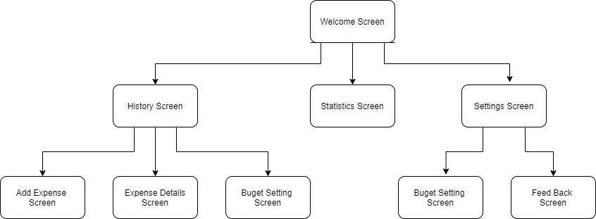
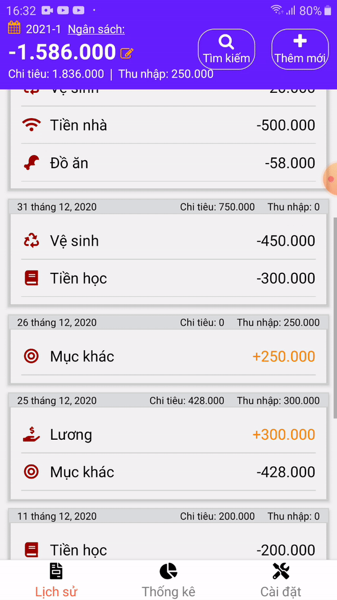
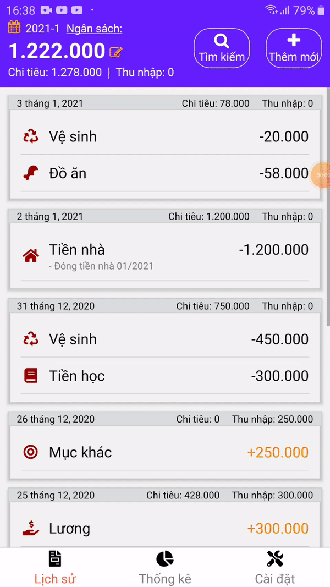
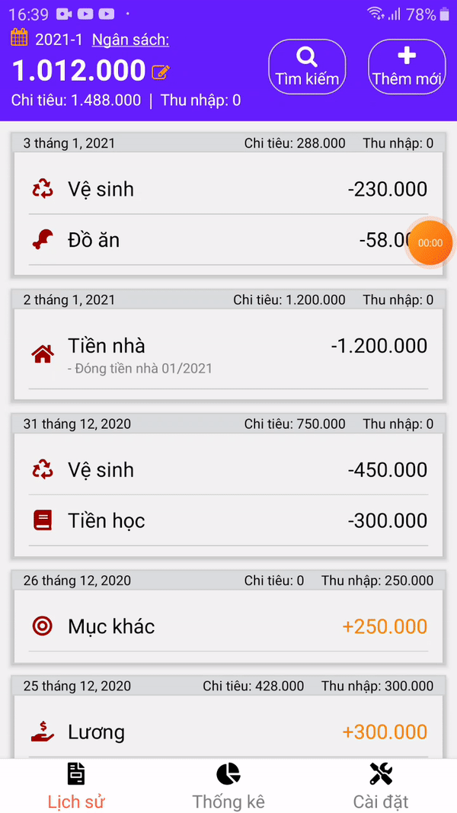
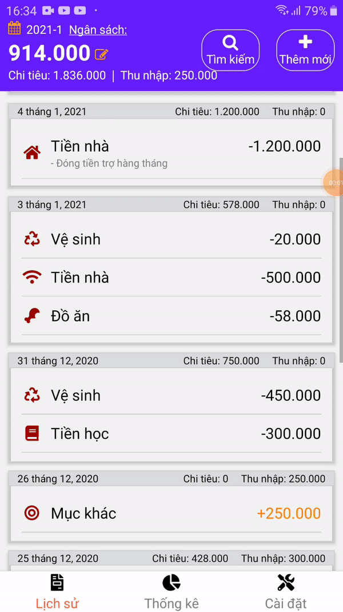
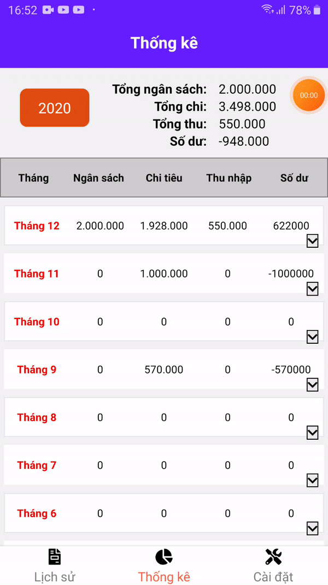

# App quản lý chi tiêu bằng React Native
## Dưới đây là một số hình ảnh cơ bản về chức năng của app:

#### Danh sách các màn hình của app:

#### 1. Cài đặt ngân sách:

#### 2. Sửa:

#### 3. Xóa:

#### 4. Tìm kiếm/Lọc:

#### 5. Màn hình thống kê:
